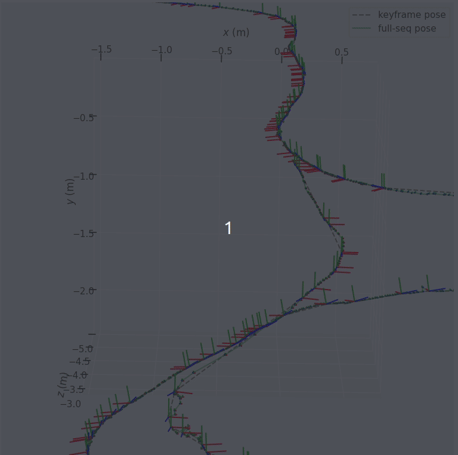

## SE3 Pose Interpolation

Pose estimated from SLAM system are always discrete, and often not equal to the original sequence frame size.

This repo helps to remedy it and interpolate the pose for any interval timestamp you want.


### Dependencies & Environment

The repo has minimal requirement:

```shell
python==3.7
numpy==1.19
transformations==2021.6.6
evo==v1.13.5
```

### How to Run

The script takes two files as input data, `keyframe pose` and `lookup timestamps`, the lookup timestamps contains much more timestamps data than keyframe sequences.

To run this script simply try:

```shell
python pose_interp.py --kf_pose ./data/kf_pose_result_tum.txt \
                      --timestamps ./data/timestamps.txt
```

The output file will be saved at the same directory with extra suffix `_interp.txt`

### File format

Please make sure the estimated key-frame pose file (e.g.: `./data/kf_pose_result_tum.txt`) is in `TUM` format:

```shell
timestamp t_x t_y t_z q_x q_y q_z q_w
```

The timestamps file for all frames (e.g.: `./data/timestamps.txt`) is saved as following:

```shell
sequence_id timestamp
```

The output interpolated pose file which contains pose for each timestamp of every frame in the original sequence (e.g.: `./data/kf_pose_result_tum_interp.txt`) is also in TUM format:

```shell
timestamp t_x t_y t_z q_x q_y q_z q_w
```

### Visualization

We use [evo](https://github.com/MichaelGrupp/evo) to visualize the pose file, simply run the following code to get the plots




### Disclaimer

This repo is adapted from [https://github.com/ethz-asl/robotcar_tools/blob/master/python/interpolate_poses.py](https://github.com/ethz-asl/robotcar_tools/blob/master/python/interpolate_poses.py)

The modification includes:

 - [x] fixed axis align mis-match bug
 - [x] add visualization for sanity check
 - [x] consistent data format with clear comments
 - [ ] loop up any given interval timestamp

If you use part of this code please cite:

```shell
@software{cheng2022poseinterp,
  author = {Lisa, Mona and Bot, Hew},
  doi = {10.5281/zenodo.1234},
  month = {12},
  title = {{SE3 Pose Interpolation Toolbox}},
  url = {https://github.com/rancheng/se3_pose_interp},
  version = {1.0.0},
  year = {2022}
}
```

and

```shell
@article{RobotCarDatasetIJRR,
  Author = {Will Maddern and Geoff Pascoe and Chris Linegar and Paul Newman},
  Title = {{1 Year, 1000km: The Oxford RobotCar Dataset}},
  Journal = {The International Journal of Robotics Research (IJRR)},
  Volume = {36},
  Number = {1},
  Pages = {3-15},
  Year = {2017},
  doi = {10.1177/0278364916679498},
  URL =
{http://dx.doi.org/10.1177/0278364916679498},
  eprint =
{http://ijr.sagepub.com/content/early/2016/11/28/0278364916679498.full.pdf+html},
  Pdf = {http://robotcar-dataset.robots.ox.ac.uk/images/robotcar_ijrr.pdf}}
```


### License

SE3_Pose_Interp is released under a MIT license (see LICENSE.txt)
If you use ORB-SLAM in an academic work, please cite the most relevant publication associated by visiting:
https://rancheng.github.io